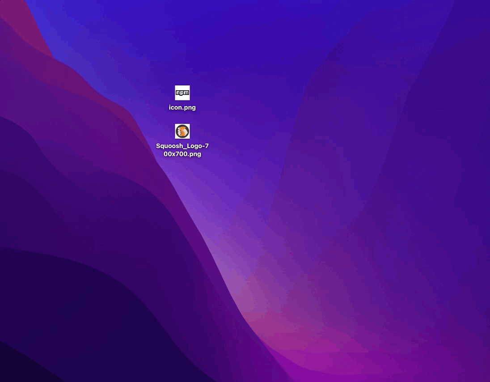
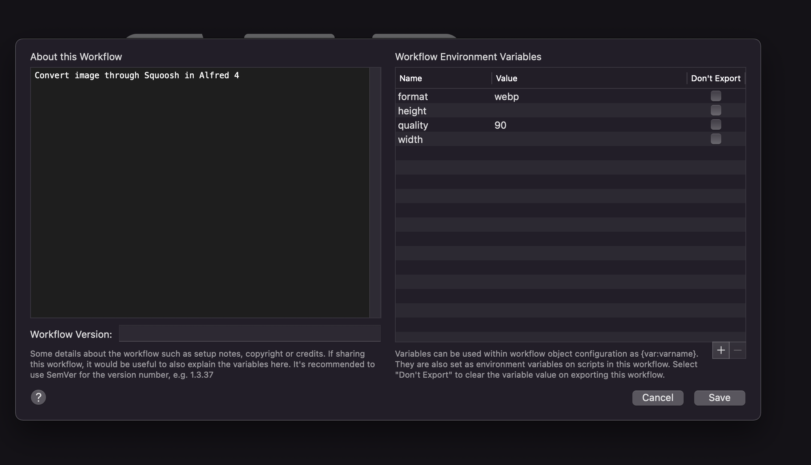

# alfred-squoosh

> Convert images through Squoosh in Alfred 4

[](http://badge.fury.io/js/alfred-squoosh)
[](http://badge.fury.io/js/alfred-squoosh)
[](https://lbesson.mit-license.org/)
[](http://makeapullrequest.com)
[](https://GitHub.com/jopemachine/alfred-squoosh/issues/)



## Install

```
$ npm install --global alfred-squoosh
```

*Requires [Node.js](https://nodejs.org) 12+ and the Alfred [Powerpack](https://www.alfredapp.com/powerpack/).*

## Usage

In Alfred, select image files and turn up the file window, type `squ`, and <kbd>Enter</kbd>.

## Config

You can change converter's setting in your config.



### width

Type: `Number`

Required: `false`

If you want to resize your image, set this value.

When either width or height is specified, the image resized to specified size keeping aspect ratio.

### height

Type: `Number`

Required: `false`

If you want to resize your image, set this value.

When either width or height is specified, the image resized to specified size keeping aspect ratio.

### format

Type: `String`

Required: `true`

Default: `webp`

### quality

Type: `Number`

Required: `true`

Default: `100`

### dest

Type: `String`

Required: `false`

Default: `process.cwd()`

## Related links

- [squoosh](https://github.com/GoogleChromeLabs/squoosh) - Image compression web app that reduces image sizes through numerous formats.

## License

MIT © [jopemachine](https://github.com/jopemachine)